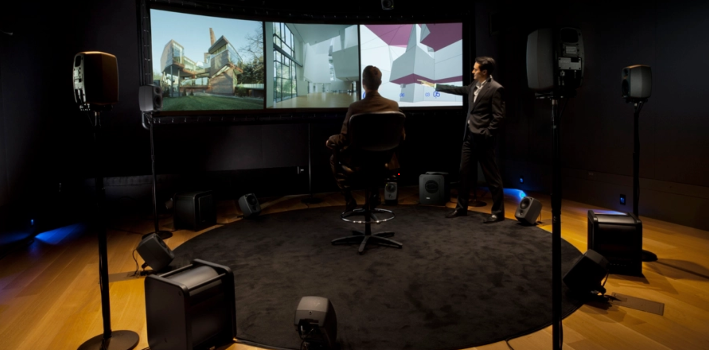
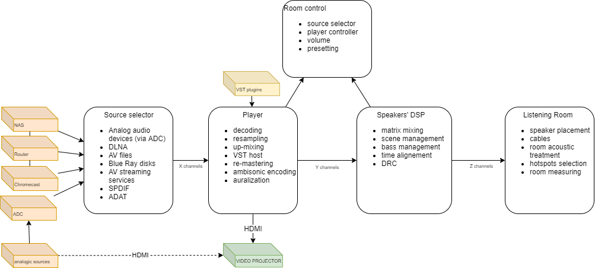
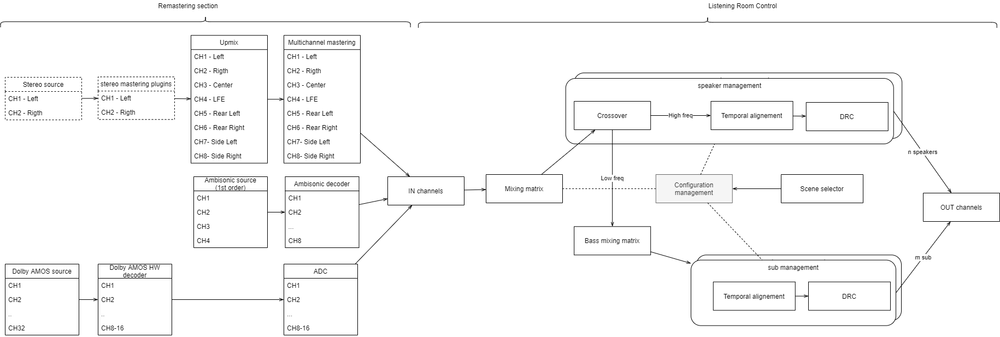

# LIROMA

MY-FI LIstening ROom Modelized by Auralization and other digital processing

## Abstract
This project aims to utilize audio signal spatialization technologies, convolution, and auralization to create an immersive listening room.

The designed system intends to reproduce the desired environment and timbre from any digital audio source, regardless of its encoding, format, resolution, or the number of its channels.

## Rationale
For a musician, especially in the realm of POP music, it has become commonplace to record their parts using virtual instruments obtained through mathematical modeling of existing instruments, whether they be old and/or iconic. Sound engineers have been using virtual compressors, equalizers, and effects for many years—digital algorithms enclosed in plugins capable of simulating the behavior of physically hard-to-find or expensive equipment.

For instance, the reverb we hear in numerous recordings is rarely real; it is merely a simulation of what naturally occurs in enclosed spaces like cathedrals, theaters, recording studios, or jazz clubs. The sonic impression of the environment is captured in a mathematical function—the *impulse*—which is then combined (*convolved*) with the original signal to achieve the desired result.

[Professor Angelo Farina](https://personale.unipr.it/it/ugovdocenti/person/18339) from the University of Parma has gone a step further by using convolution and impulses to predict and listen to the acoustics of theaters and concert halls *before* they are constructed. This is made possible through a process called [auralization](https://en.m.wikipedia.org/wiki/Auralization), which convolves audio signals recorded in anechoic environments with an acoustic model of the theater developed by specific software, and transforms them into *immersive audio* for binaural listening using regular headphones, as well-described in [this article](http://pcfarina.eng.unipr.it/Public/Papers/119-Ciarm98.PDF). It is also possible to experience immersive audio using a network of independent speakers coordinated by sophisticated audio rendering algorithms based on technologies such as [ambisonics](https://en.m.wikipedia.org/wiki/Ambisonics) or [SPS](http://www.angelofarina.it/sps-conversion.htm). 

Currently, there are [standards](https://www.aes.org/e-lib/browse.cfm?elib=4782) for "pro" listening rooms, specifically control and mastering rooms designed for multichannel productions.
From the consumer point of view, the extreme subjectivity regarding aesthetic judgment of sound reproduction has recently given rise to the notion of [MY-FI](https://www.afdigitale.it/my-fi-audio-una-necessaria-e-logica-personalizzazione/), acknowledging the impossibility of having a *perfect system* that sounds excellent in any environment and with any music genre. In fact, even listening to the signal in a production studio often does not satisfy purely hedonistic points of view; indeed, many audiophiles describe such sound as fatiguing, cold, excessively detailed, and so on.

In essence, it can be affirmed that each audio system possesses its own distinctive qualitative characteristics resulting from the combination of equipment, preferred music genre, source signal, and listening environment. The latter is understood in its broadest sense, encompassing the room's geometry, construction materials, furnishings, acoustic treatment, placement of audio equipment, and even the most minute accessories, which are the domain of *fine-tuning* enthusiasts.

## Vision and project Objective
The vision of this project is to utilize modern audio rendering technologies, convolution, and auralization to create a home listening room that can replicate the emotional experience obtained in various reference environments (HI end reference systems, acoustic concerts, jazz clubs, cinemas, pop concerts, etc. etc.). All of this should be achievable within a single environment, at reasonable costs, and with the ability to virtually change the audio system configuration for each musical track, adapting it to individual aesthetic preferences.

The fundamental idea behind the project is to describe, using mathematical tools (i.e., impulses):
1. The transfer function of a reference listening room where a specific audio reproduction setup (*target environment*) operates.
2. The transfer function of one's own listening room.

Then, these functions will be used to compute a transformation of the input signal that replicates, within one's own domestic environment, the listening experience of the target environment.

While the project is primarily in the domain of pure entertainment, with appropriate modifications, it could serve as a proof-of-concept for a more ambitious project.

If the theoretical objective is fully achieved, simply by changing the first of the input functions, it would be possible to listen to a recorded signal as it would sound on any audio system (professional or high-end) without any physical modification to one's own playback system. For example, listening to Louis Armstrong with electrostatic speakers, or a Marcus Miller solo with a powerful horn system, and even mixing the audio of a video in stereo, 5.1, 7.1, and Dolby ATMOS formats.

Taking note of the impossibility of effectively capturing the impulses of a reference system and the current inability to use auralization algorithms in non-anechoic environments (or in headphones), pragmatically, the  objective of this project can be summarized in the following points:
- allowing real-time "mastering" of the incoming audio material to adapt it to personal preferences,
- supporting playback of any type of source format regardless of its encoding, format, resolution, or the number of its channels,
- simulating a room with desired acoustic properties (e.g., simulating a big concert hall in a small space).

## Requirements
The functional requirements of the system are grouped into 5 main areas:

1. Requirements related to **input signals**, which highlight the compatible inputs with the audio reproduction system.
2. Requirements related to the **player**, the tool responsible for decoding the input signals, standardizing them, and applying any coarse-grained transformations. This tool also handles the display of video and compensates for any delays introduced by the audio processor chain. Optimal video display is not a top priority in this project.
3. Requirements related to the **Digital Signal Processor (DSP)**, the tool responsible for performing qualitative transformations on the input signals (remastering) and rendering sound in 3D. It represents the core of the system and is implemented through a pipeline of digital audio processors.
4. Functional requirements related to the **listening room configuration**, which involves setting up the physical layout, positioning of speakers, and acoustic treatment to achieve the desired listening experience.
5. Requirements related to **control applications**, through which the listener can interact with the system (selecting songs, adjusting volume, changing listening configurations). Typically, this interaction is done using a tablet or a standard smartphone.
6. 
Here is a functional view of the system:

The heart of the system is undoubtedly the chain of digital processors. The current hypothesis for this project (any advice and alternatives are welcome) is to use a VST host and a series of VST plugins for mastering functions, along with some hardware DSP processors to handle bass management, dynamic range control (DRC), and time alignment in the speaker network.

The planned plugin pipeline is summarized in the following figure:

## Constraints
Despite the attempt to operate as scientifically as possible, it is reasonable to assume that in practice, some ideal conditions assumed by the theory may not be met, and compromises may be necessary. These compromises will make the results of this project subjective and difficult to replicate. With this awareness, we accept the following constraints:

- The room should be primarily dedicated to listening, meaning its furnishings should not change frequently over time to avoid recomputing its transfer function with every change.
- The system will be optimized for a single listening position (*hot spot*), similar to a standard stereo setup today.
- The listening room should be acoustically treated to limit standing waves and early reflections, at least in the hot spot area.
- The listening room should contain 12 to 20 independent loudspeakers and at least one subwoofer dedicated to bass frequencies below 100Hz. The use of one or more subwoofers aims to reduce the size and cost of the main speakers and minimize phase issues, making the sources as close to point sources as possible.
- The input signal should be exclusively digital, meaning any analog sources must undergo a process of digitization *before* being reproduced.
- The speaker system must be capable of delivering **83 dB SPL** at the hot spot, calculated with a calibration signal, and allow for a peak SPL of at least 103dB as recommended by Bob Katz in chapter 14 of his book "Mastering Audio." This value could be increased to 93 dB SPL if adhering to [THX specifications](http://www.acousticfrontiers.com/2013314thx-reference-level/).
- The speaker system should have a frequency response with minimal discontinuities, at least in the 100-18K range, and the phase rotation should not exhibit excessive jumps. Absolute linearity is not strictly required.
- The speaker system must include at least one subwoofer capable of emitting frequencies down to 20Hz with a peak sound pressure level of 115dB at the hot spot, according to THX specifications. This requirement implies the need for one or more large and high-performance subwoofers.
- The harmonic distortion induced by the amplification should remain below 0.1 dB.
- The harmonic distortion of the speakers should be as low as possible at the nominal sound pressure level required (the reference value and measurement method are yet to be determined).
- The total background noise should be very low, approximately in the range of 20 to 30 dB SPL, calculated with the system on and no signal present.

> The project aims for a useful dynamic range of approximately 80dB, just over 13 bits, which is considerably lower than the theoretical limit of 96dB resulting from CD specifications, but still much higher than the real resolution in the vast majority of commercial recordings (see [loudness war db](https://dr.loudness-war.info/)). Noise can be added later, and [it can be beneficial to do so](https://www.musicradar.com/tuition/tech/10-ways-to-use-noise-to-enhance-your-mixes-633348) because background noise also contributes to the sonic character of a system, and perceived dynamics don't always align with theoretical ones (as with LPs, for example). Moreover, dithering is a well-established, if not obligatory, practice in mastering processes.

> [Note on linearity]
>
> It should be noted that perfect linearity in phase and frequency response is not a strict requirement, as DRC (Digital Room Correction) and auralization algorithms can correct both phase and frequency response within reasonable limits. Additionally, phase rotation and non-linear frequency response are inevitably introduced by any listening environment that is not anechoic and are, in fact, the primary components that characterize audio reproduction. Absolute linearity of the system's response, which is a goal in professional listening, can only be approximated, as is the case in the vast majority of small and medium-sized project studios.

The following constraints are useful to simplify the system's complexity:

- The speakers must be directional and project sound predominantly frontally (no dipoles) to predict and limit early reflections.
- The positioning of the speakers should preferably be symmetric with respect to the hot spot; in an optimal situation, the speakers should be symmetrically placed on the surface of a sphere, with the hot spot at the center. However, the project also includes adjustments to temporal alignment and emission volume to compensate for any minor differences.
- The sampling frequency for digital signal processing is set at 44.1 kHz with a resolution of 24 bits to limit the required computational power and to allow for the use of cost-effective transmission lines (8 channels on a single ADAT optical fiber). It is observed that this frequency and resolution are more than sufficient to meet the required sound pressure level and SNR constraints. However, any higher or lower input signal resolutions will require a preliminary non-critical resampling using the available down-sampling algorithms.
- The exact match of speaker models is not a strong requirement because each speaker must be individually equalized.

## Reference implementation

### Software
- [REW - Room EQ Wizard Room Acoustics Software](https://www.roomeqwizard.com/) for measurements
- Yamaha DME Designer [[Download](https://it.yamaha.com/support/updates/dme_des.html)] [[Doc](https://it.yamaha.com/files/download/other_assets/5/325135/dme64n_en_om_h0.pdf)] for speaker processors
- [JRiver Media Center](https://jriver.com/) for media player, re-mastering, vst host and DLNA server
- [RME Totalmix](https://www.rme-audio.de/totalmix-fx.html) for player routing to speaker processor
- Mastering plugins (TBD)
- [jremote APP](https://jremote.jriver.com/) as DNLA controller
- Synology Nas for media storage

### Services
- Amazon Music HD plan

### Hardware
- Windows 10 old PC to host Player and HW controls (64 bit)
- Chromecast audio with optical out
- DAC RME Fireface 800 (for analogicin out, digital,), Motu 2408 (x2) for analogic out
- Yamaha DME64N + 2 My16 Adat boards
- 10x cheap speakers for auralization and spatialization driven by rotel + denon multichannel amps
- 2x Klipsch Cornwall as front monitors driven by electrocompaniet amp
- Klipsch Heresy as center driven by quad amp (bi-amplification)
- Genelec 7070 for infra sub/ LFE
- 2x Yamaha sub
- 2x Tannoy for rear surround (stage accompany amp)

### Room 

Two distinct physical areas are planned:

1. An area to place the noisy equipment, mainly due to fans and processor cooling systems.
2. A listening room with a geometry that is symmetrical with respect to the hot spot

- mappa fisica
- analisi dei modi
- dumping

### Cabling

### Speaker management

### Remastering

## How to Contribute to the Project
Many aspects of this project are still open for discussion, and for each of these points, a [Polis](https://pol.is/home) area is available as a conversational platform, in the hope of reaching a shared opinion:

- [What's the best digital processing pipeline manager: a simple VST host or DAW?](https://pol.is/9wpnehy6ue)
- [SPS or ambisonics: which plugins to use?](https://pol.is/5ka3essadr)
- [Best buy suggestions for speakers and amp in LIROMA?](https://pol.is/8eardcdusj)

If you notice any errors, omissions, or have suggestions for extensions, please report them in the [issues](https://github.com/ecow/liroma/issues) of this project.

If you have implemented something similar and want to share your experience, please let me know, and I will include it in a section of this project.

## License
This project is Copyright by Enrico Fagnoni and is released under the [CC BY 4.0 License](https://creativecommons.org/licenses/by/4.0/). The software specifically developed for this project is released under the [MIT License](LICENSE).

## References
This project owes its existence to the extraordinary works of some authors, to whom I have the greatest admiration:

- Angelo Farina [ambisonic pages](http://pcfarina.eng.unipr.it/ambisonics.htm)
- Alberto Amendola and Angelo Farina - [SPS](http://www.upv.es/contenidos/ISVA2011/info/U0568405.pdf)
- Michael Vorländer - [Auralization: Fundamentals of Acoustics, Modelling, Simulation, Algorithms and Acoustic Virtual Reality](https://www.amazon.it/Auralization-Fundamentals-Acoustics-Simulation-Algorithms/dp/3642080235)
- Bob Kats - [Mastering Audio: The Art and the Science](https://www.amazon.it/Mastering-Audio-Science-Bob-Katz/dp/0240818962).
- David Monacchi - [FRAGMENTS OF EXTINCTION](https://www.fragmentsofextinction.org/)
- Alaa Algargoosh and John Granzow [How can a room shape your voice?](https://acoustics.org/2aaa-developing-a-new-method-for-analyzing-room-acoustics-based-on-auralization-how-can-a-room-shape-your-voice/)