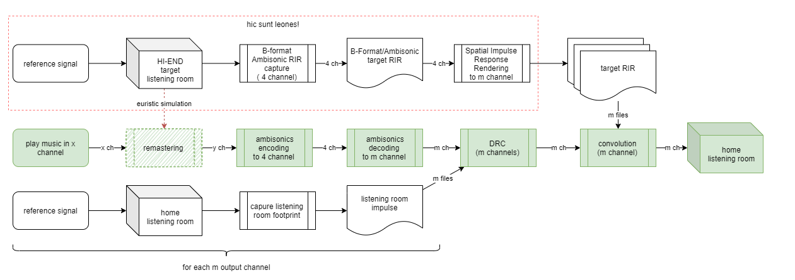
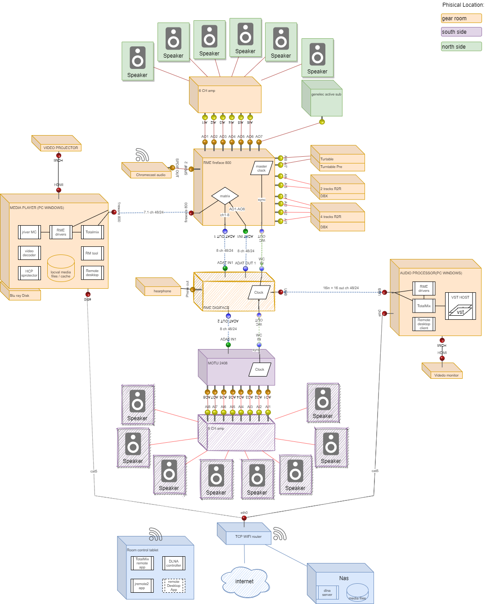

# LIROMA

MY-FI LIstening ROom Modelized by Auralization and other digital processing

> **CALL FOR ACTION: please help me with english translation**

Questo progetto si propone di utilizzare le tecnologie di spazializzazione dei segnali audio, le tecnologie di convoluzione e auralizzazione per realizzare una sala d'ascolto domestica a relativo  basso costo in cui replicare l'esperienza emotiva che si ottiene con diverse tipologie di impianti HI-END. 

Il sistema vuole essere in grado di riprodurre l'immagine sonora e la timbrica desiderate partendo da un qualsiasi audio digitale, indipendentemente dalla sua codifica, formato e risoluzione (PCM, DTS, mp3, Dolby Digital, ATMOS, etc. etc) e dal suo numero di canali (mono, stereo, 3.0, 4.0, 5.1, 7.1 ).

## Razionale

Per un musicista, soprattutto nella musica POP, è ormai cosa normale registrare le proprie parti utilizzando una strumentazione virtuale, ottenuta attraverso la modellazione matematica di strumenti esistenti, più o meno antichi e/o iconici. I tecnici del suono da molti anni modificano i suoni registrati attraverso compressori, equalizzatori e anche microfoni  virtuali, cioè attraverso  algoritmi racchiusi in plugin in grado di simulare il comportamento di apparati di difficile reperimento o molto costosi.
Anche il riverbero che ascoltiamo in moltissime registrazioni non è reale: è solo una simulazione di quello che naturalmente si produce in spazi chiusi come cattedrali, teatri, studi di registrazione, jazz club. La impronta sonora (impulso) dell’ambiente  viene catturata in una funzione matematica che poi viene composta (convoluta) al segnale di partenza per ottenere il risultato desiderato. Grazie alla potenza degli attuali computer e allo sviluppo di algoritmi numerici particolarmente efficaci, la convoluzione è oggi alla portata di tutti e per ascoltare una propria registrazione come se fosse stata fatta in S.Pietro o in uno stadio, basta  selezionare da un menù l’impulso corrispondente all’ambiente desiderato.

Il [prof. Angelo Farina](https://personale.unipr.it/it/ugovdocenti/person/18339) dell' Università di Parma si è spinto oltre, utilizzando gli strumenti della convoluzione per predire e ascoltare l'acustica di teatri e sale da concerto *prima* di che vengano costruite.
Ciò è possibile attraverso un processo chiamato [auralizazione](https://en.m.wikipedia.org/wiki/Auralization) e tratta segnali audio registrati in ambienti aneacoidi e li trasforma in audio immersivo per un ascolto binaurale con normali cuffie come ben descritto in [questo articolo](http://pcfarina.eng.unipr.it/Public/Papers/119-Ciarm98.PDF).  È anche possibile sperimentare l'audio immersivo grazie ad una rete di altoparlanti indipendenti e coordinati a loro volta da sofisticati algoritmi di rendering audio 3d basati sulle tecnologie [ambisonics](https://en.m.wikipedia.org/wiki/Ambisonics) o [SPS](http://www.angelofarina.it/sps-conversion.htm)

> 
> Molti già conoscono l'audio immersivo per averlo sperimentato al cinema nelle colonne sonore dei film o anche a casa propria grazie alle tracce multicanale Dolby Digital e DTS, oggi presenti anche in molti servizi di streaming. L'ascolto di tali tracce richiede una configurazione fissa di altoparlanti, che vanno  posizionati in una geometria ben definita per ottenere i risultati spaziali previsti dal regista.  Stanno prendendo sempre più piede formati di audio streaming basati su audio spaziale (Dolby Amos, 4D) che però principalmente sono proposti per un ascolto in cuffia. 
> 
> Il mondo della riproduzione sonora domestica rimanda immediatamente al concetto di Alta Fedeltà (HI-FI) che ha avuto il suo boom a partire dagli anni 70 con la produzione di innumerevoli apparati audio/video, alcuni dei quali sono diventati oggetto dei desideri di generazioni di *audiofili* e collezionisti. A onor del vero, nel modo HI-FI il concetto di audio  multicanale è spesso declinato nella sola stereofonia anche se esistono esperimenti notevoli in ambito quadrifonico, 3 canali e l’utilizzo di di configurazioni di derivazione cinematografica ( superaudiocd, DVD audio, BluRay Audiom, Dolby ATMOS)  per formati solo audio.
> 

La estrema soggettività sul giudizio estetico relativo di una riproduzione sonora ha, più recentemente, fatto emergere la nozione di [MY-FI](https://www.afdigitale.it/my-fi-audio-una-necessaria-e-logica-personalizzazione/) che prende atto dell'impossibilità di avere un *impianto perfetto* ovvero ben suonante in qualsiasi ambiente e su qualsiasi genere musicale. Infatti anche l'ascolto del segnale "così come registrato" in uno studio di produzione, importante per un tecnico al fine di scoprire ed eliminare eventuali difetti nella registrazione, molto spesso non risulta soddisfacente da un punto di vista meramente edonistico; spesso infatti molti audiofili etichettano tale suono come affaticante, freddo, eccessivamente dettagliato, etc..etc. 

Di fatto queste considerazioni hanno portato dividere il mercato degli apparati audio di qualità in due grandi segmenti: 
*PRO* e *HI-END*,
il primo ricercan la massima fedeltà alla registrazione (che spesso è ben altra cosa rispetto alla fedeltà all'evento), i secondi prediligono la piacevolezza di ascolto o una evocazione emotiva dell'evento originario (che spesso nessuno ha mai potuto ascoltare).

Oggi esistono [standard](https://www.aes.org/e-lib/browse.cfm?elib=4782) per una sala di ascolto "pro", in virtù dell'esistenza di un riferimento ultimo oggettivo mirato alla riduzione di qualsivoglia colorazione del segnale originale, ma non esistono standard per un ascolto di tipo *edonistico* in cui alcune colorazioni, sono addirittura ricercate: si pensi al suono prodotto dalla naturale saturazione delle valvole o dalla compressione del nastro magnetico. Occorre anche dire che, anche  in assenza di standard,  alcune esperienze di ascolto HI-END sono riconosciute appaganti, se non universalmente almeno a grande maggioranza; ad esempio sono pochi quelli che non si emozionano ascoltando la voce di Louis Armstrong su una copia di vecchie casse elettrostatiche, magari proveniente da una copia del master originale su registratore a bobine. Peccato però che lo stesso impianto, alle prese con una moderna registrazione di musica elettronica risulti del tutto inadeguato a riprodurre la necessaria pressione sonora (soprattutto nelle basse frequenze). Situazione inversa se si prendono in considerazione impianti di alta qualità basati su potenti diffusori a tromba.

In sostanza si può ragionevolmente  affermare che ogni impianto possiede una propria fisionomia risultante dalla combinazione di apparati, segnale sorgente e ambiente di ascolto inteso nella sua accezione più ampia che comprende la geometria della stanza, i materiali con cui è costruita, l'arredamento, il trattamento acustico, la collocazione degli apparati audio fino ai più minuti accessori ritenuti essenziali agli appassionati di *fine tuning*. 

## Obiettivo del progetto

Questo progetto si propone di utilizzare le tecnologie di rendering audio 3d, le tecnologie di convoluzione e auralizzazione per realizzare una sala d'ascolto domestica a relativo  basso costo in cui replicare l'esperienza emotiva che si ottiene con diverse tipologie di impianti HI-END. Il tutto senza doverne subire il costo e permettendosi di cambiare impianto (virtualmente) anche ad ogni brano musicale adattando al proprio gusto estetico e non viceversa come spesso avviene oggi.

L’idea alla base del progetto è di descrivere tramite strumenti matematici (es. impulsi):
- la funzione di trasferimento di sala di ascolto di riferimento in cui è opera una  configurazione di componenti per la riproduzione audio (*target*)
- la funzione di trasferimento della propria sala di ascolto

Utilizzare poi queste funzioni per computare una trasformazione del segnale in ingresso che simuli, nel proprio ambiente domestico, un'esperienza di ascolto simile a quella ottenuta ascoltando lo stesso segnale registrato nella sala di ascolto target.

Se l’obiettivo fosse raggiunto, semplicemente cambiando solo la prima in ingresso, sarebbe possibile ascoltare un segnale registrato così come riprodotto da un qualsiasi impianto senza alcuna modifica fisica al proprio sistema di riproduzione. Ad esempio ascoltare Luis Amstrong con casse elettrostatiche, o un solo di Marcus Miller con un potente sistema a trombe o godersi l'ultima registrazione pubblicata in formato Dolby ATMOS a 16 canali

## How it works

well... how it could works is simplified in this wokflow:

the main open point is how to capture the footprint of the target HI-END system. In a first step a *trial and error* approach can be used.

Some well known re-mastering tecniques (eq, multiband compressions, reverberation, etc. etc.) can be also applied in real time to mimic the HI-END macro-characteristics.
## Vincoli

Nonostante la volontà di operare in modo più possibile scientifico, è ragionevole ipotizzare che nella pratica alcuni requisiti imposti dalla teoria non possano essere rispettati e quindi occorra scendere a compromessi. Tali compromessi renderanno i risultati di questo progetto comunque soggettivi, difficilmente replicabili e migliorabili. Con questa consapevolezza in questo progetto accettiamo di applicare i seguenti requisiti:

- la stanza di ascolto domestica dovrà essere dedicata all’ascolto, nel senso che il suo arredamento non deve mutare sovente nel tempo, per evitare di dover ricomputare ad ogni cambiamento la sua funzione di trasferimento.
- il sistema sarà ottimizzato per un unico punto di ascolto (*hot spot*), in modo non dissimile a quanto avviene oggi con un normale impianto stereo.
- al fine di semplificare la vita agli algoritmi di auralizzazione e correzione acustica, la sala di ascolto dovrà essere trattata acusticamente per limitare i macro difetti (es.onde stazionarie) e le riflessioni sulle alte frequenze, in particolare le prime riflessioni, almeno nell’hot spot
- la stanza di ascolto dovrà contenere almeno 15 casse acustiche indipendenti di cui almeno una dedicata ai bassi profondi (sotto i 100Hz). L’utilizzo di uno o più sub è finalizzato a ridurre le dimensioni delle casse e quindi il loro costo ma anche a minimizzare i problemi con le fasi,
- il segnale in ingresso sarà esclusivamente digitale, il che significa che eventuali sorgenti analogiche debbano subire un processo di digitalizzazione *prima* per essere riprodotte
- il sistema di altoparlanti deve essere in grado di erogare nell’ hot spot  una pressione di ** 83 dB SPL** calcolato su con un segnale di calibrazione e permetta di avere un picco di SPL di almeno 103dB come consigliato da Bob Kats nel cap.14 del suo libro "Mastering Audio". Tale valore potrebbe essere incrementato a 93 dB SPL se si desidera seguire le specifiche [THX](http://www.acousticfrontiers.com/2013314thx-reference-level/) per l’audio di film 
- il sistema di altoparlanti deve avere  una risposta di frequenza senza eccessivi sbalzi almeno nel range 100-18K anche la rotazione di fase non dovrebbe avere eccessivi salti.
- il sistema di altoparlanti deve comprendere almeno un sub woofer in grado di emettere le frequenze da 20Hz con una pressione sonora con un picco di 115db nell’hot spot in accordo con le specifiche THX. Si noti come tale requisito si rifletta sulla necessità nei fatti di avere uno o più subwoofer molto grossi e performanti
- la distorsione armonica indotta dall'amplificazione dovrebbe mantenersi sotto la soglia di 0.1 db
- la distorsione armonica delle casse sia più bassa possibile al valore di pressione nominale richiesto (che valore mettere come riferimento?)
- il rapporto segnale rumore totale degli apparati deve essere molto basso, comunque inferiore a quello della stanza con impianto spento ( cioè circa < 23 dB SPL nel migliore dei casi). Questo significa avere un range dinamico di 80dB, cioè molto superiore a quello presente nella quasi totalità delle registrazioni commerciali. Ad aggiungere rumore si fa sempre in tempo, e [può essere conveniente farlo](https://www.musicradar.com/tuition/tech/10-ways-to-use-noise-to-enhance-your-mixes-633348) perché anche il rumore di fondo concorre alla fisionomia di un impianto. D'altronde il dithering è prassi consolidata, se non obbligatoria, anche nei processi di mastering.

Si osservi che la assoluta linearità di risposta in fase e in frequenza non è un requisito, perché gli algoritmi di DRC e auralizzazione permettono di correggere sia fase che risposta in frequenza entro ragionevoli vincoli; peraltro la  rotazione di fase e frequenza è inevitabilmente introdotta da qualsiasi ambiente di ascolto che non sia anecoico. Infine la distorsione in fase e in frequenza sono due delle principali componenti che influenzano la timbrica complessiva dell’impianto.

In aggiunta ai requisiti suddetti si aggiungono i seguenti vincoli, per semplificare la complessità di configurazione degli algoritmi coinvolti:

- le casse dovrebbero essere identiche o almeno molto simili 
- il pattern di direzionalità, che dovrebbe essere il più possibile stretto e comunque proiettato frontalmente (no dipoli)
- il posizionamento delle casse dovrebbe essere preferibilmente simmetrico rispetto all’hot-spot, in una situazione ottimale, le casse dovrebbero essere equidistanti, anche se una correzione dell’allineamento temporale è comunque prevista nel progetto
- la frequenza di campionamento per il trattamento dei segnali digitali è fissata a 48Khz con una risoluzione di 24bit al fine di limitare la potenza computazionale (e quindi il costo) degli apparati di elaborazione e per permettere di utilizzare linee di trasmissione economiche (ADAT). Si osserva come comunque la frequenza e la risoluzione è ampiamente sufficiente a realizzare i vincoli di pressione acustica e SN richiesti. Eventuali risoluzioni più alte o più basse in ingresso richiedono un ricampionamento alla fonte che si giudica non critico grazie agli attuali algoritmi oggi disponibili.

## Requisiti funzionali

I requisiti funzionali del sistema sono raccolti in 5 macro aree:

- requisiti relativi ai **segnali in ingresso**, che evidenziano quali input sono compatibili con il sistema di riproduzione
- i requisiti relativi al **player**, ovvero lo strumento che si occupa di decodificare i segnali di ingresso standarizzandoli e applicando eventuali trasformazioni *a grana grossa*. Trale strumento si occupa di visualizzare eventuali contributi video facendosi carico di compensare eventuali ritardi introdotti dalla la catena dei processori a valle.
- i requisiti relativi al **Digital signal processor**, ovvero lo strumento di effettuare le trasformazioni qualitative nei segnali di ingresso (remastering) e di rendering del suono in 3D. Rappresenta il cuore del sistema ed è realizzato attraverso una *pipeline* di processori digitali
- i requisiti funzionali relativi alla configurazione della **sala di ascolto**
- i requisiti relativi alle **applicazioni di controllo** tramite cui l’ascoltatore può interagire con il sistema (scelta brani, set-up volume, cambio configurazione di ascolto) tipicamente attraverso un tablet o un normale smartphone 

I requisiti funzionali sono raccolti nel seguente diagramma:

## Deploy example

La seguente figura mostra una possibile realizzazione logica del progetto:

Sono previste due aree distinte:
- un'area in cui collocare la strumentazione rumorosa, principalmente a causa di ventole e sistemi di raffreddamento dei processori
- una sala di ascolto con una geometria simmetrica rispetto alla sala di ascolto, per semplicità suddivisa in due aree: *sud* ovvero di fronte all’ascoltatore e *nord* ovvero di spalle all’ascoltatore.
la parte video è limitata ad un singolo videoproiettore facilmente sostituibile con un monitor video (anzi meglio, per limitare rumori di fondo)

## Vst host

Il cuore del sistema è senza dubbio la catena di processori digitali. L’ipotesi attuale in questo progetto (a sono graditi consigli e alternative) è di usare un VST host e una serie di plugin VST, a parità di qualità sono da preferire plugin con codice open source, ma tale tipo di licenza non è un requisito.

La pipeline di plugin prevista è sintetizzata nella seguente figura:

## Come contribuire al progetto

Molti punti in questo progetto sono ancora aperti, per ciascuno di questi è stata aperta un’area di discussione utilizzado [Polis](https://pol.is/home) come piattaforma conversazionale, nella speranza che emerga una opinione condivisa:

- [what’s the best digital prcessing pipeline manager: simple VST host or DAW?](https://pol.is/9wpnehy6ue)
- [SPS or ambisonics: what plugins?](https://pol.is/5ka3essadr)
- [Best buy suggestions for speakers and amp in LIROMA?](https://pol.is/8eardcdusj)

Ovviamente vi prego di segnalare ogni errore, omissione, richiesta di estensione nelle [issues](https://github.com/ecow/liroma/issues) di questo progetto.

Se avete realizzato qualcosa di simile e volete condividere la vostra esperienza segnalatemelo e provvedeò ad inserirlo in una sezione di questo progetto.
## Licenza

Il seguente progetto è rilasciato con licenza  eventuale sw sviluppato per questo progetto sarà rilasciato con licenza [MIT](LICENSE) 

## References

Questo progetto nasce dopo aver letto alcuni straordinari lavori, ai cui autori va la mia più grande ammirazione:

- Angelo Farina [ambisonic pages](http://pcfarina.eng.unipr.it/ambisonics.htm)
- Alberto Amendola and Angelo Farina - [SPS](http://www.upv.es/contenidos/ISVA2011/info/U0568405.pdf)
- Michael Vorländer - [Auralization: Fundamentals of Acoustics, Modelling, Simulation, Algorithms and Acoustic Virtual Reality](https://www.amazon.it/Auralization-Fundamentals-Acoustics-Simulation-Algorithms/dp/3642080235)
- Bob Kats - [Mastering Audio: The Art and the Science](https://www.amazon.it/Mastering-Audio-Science-Bob-Katz/dp/0240818962).
- David Monacchi - [FRAGMENTS OF EXTINCTION](https://www.fragmentsofextinction.org/)
  