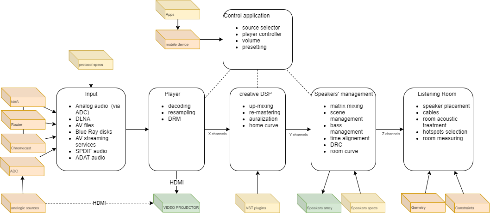
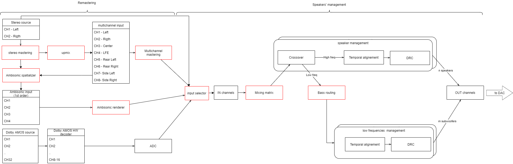
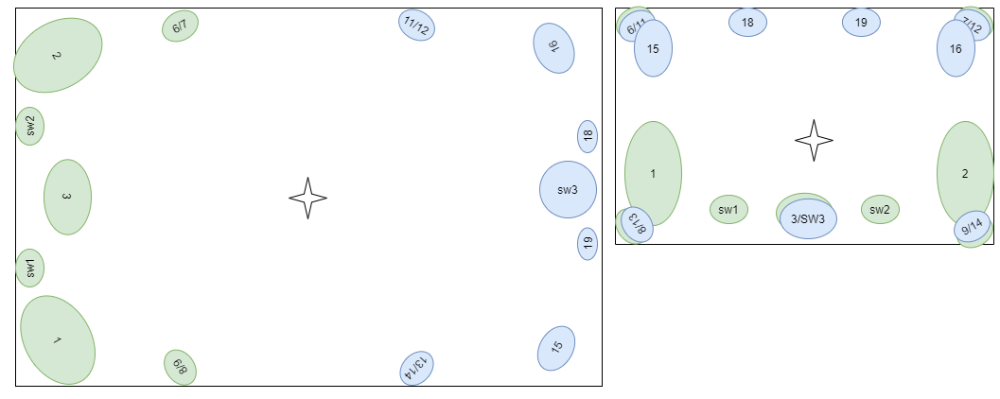
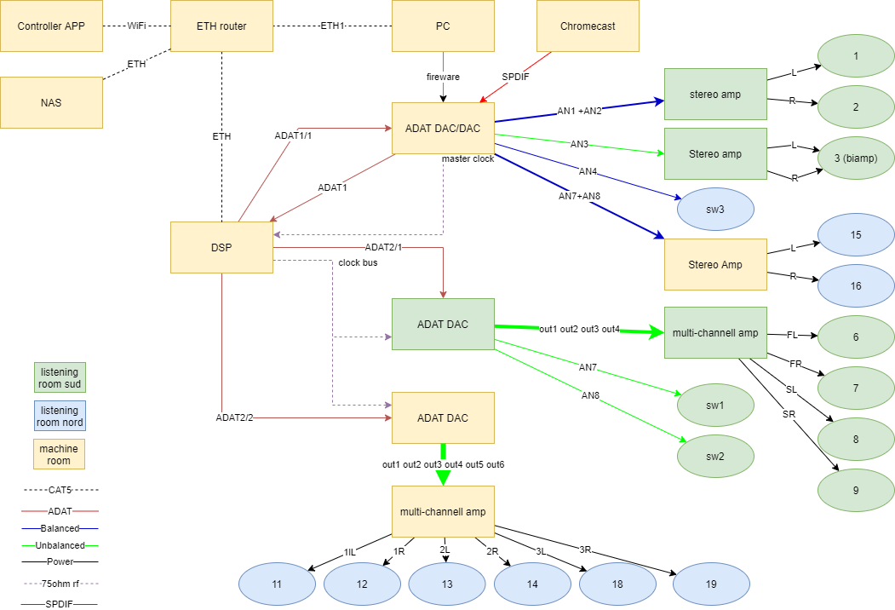

# LIROMA

MY-FI LIstening ROom Modelized by Auralization and other digital processing

## Abstract
This project aims to use audio signal spatialization technologies, convolution, and auralization to create a personal, software configurable, immersive listening room.

The designed system intends to reproduce the desired sound, environment, and timbre from any digital audio source, regardless of its encoding, format, resolution, or number of channels.

## Rationale
For a musician, especially in the realm of POP music, it has become commonplace to record their parts using virtual instruments obtained through mathematical modeling of existing instruments, whether they be old and/or iconic. Sound engineers have been using virtual compressors, equalizers, and effects for many years—digital algorithms enclosed in plugins capable of simulating the behavior of physically hard-to-find or expensive equipment.

For instance, the reverb we hear in numerous recordings is rarely real; it is merely a simulation of what naturally occurs in enclosed spaces like cathedrals, theaters, recording studios, or jazz clubs. The sonic impression of the environment is captured in a mathematical function—the *impulse*—which is then combined (*convolved*) with the original signal to achieve the desired result.

[Professor Angelo Farina](https://personale.unipr.it/it/ugovdocenti/person/18339) from the University of Parma has gone a step further by using convolution and impulses to predict and listen to the acoustics of theaters and concert halls *before* they are constructed. This is made possible through a process called [auralization](https://en.m.wikipedia.org/wiki/Auralization), which convolves audio signals recorded in anechoic environments with an acoustic model of the theater developed by specific software, and transforms them into *immersive audio* for binaural listening using regular headphones, as well-described in [this article](http://pcfarina.eng.unipr.it/Public/Papers/119-Ciarm98.PDF). It is also possible to experience immersive audio using a network of independent speakers coordinated by sophisticated audio rendering algorithms based on technologies such as [ambisonics](https://en.m.wikipedia.org/wiki/Ambisonics) or [SPS](http://www.angelofarina.it/sps-conversion.htm). 

Currently, there are [standards](https://www.aes.org/e-lib/browse.cfm?elib=4782) for "pro" listening rooms, specifically control and mastering rooms designed for multichannel productions.
From the consumer point of view, the extreme subjectivity regarding the aesthetic judgment of sound reproduction has recently given rise to the notion of [MY-FI](https://www.afdigitale.it/my-fi-audio-una-necessaria-e-logica-personalizzazione/), acknowledging the impossibility of having a *perfect system* that sounds excellent in any environment and with any music genre. Even listening to the signal in a production studio often does not satisfy purely hedonistic points of view; indeed, many audiophiles describe such sound as fatiguing, cold, excessively detailed, and so on.

In essence, it can be affirmed that each audio system have its own distinctive qualitative characteristics resulting from the combination of equipment, preferred music genre, source signal, and listening environment. The latter is understood in its broadest sense, encompassing the room's geometry, construction materials, furnishings, acoustic treatment, placement of audio equipment, and even the most minute accessories, which are the domain of *fine-tuning* enthusiasts.

## Vision and Project's Objective
The vision of this project is to use modern audio rendering technologies, convolution, and auralization to create a home listening room that can replicate the emotional experience obtained in various reference environments (HI end reference systems, acoustic concerts, jazz clubs, cinemas, pop concerts, etc. etc.). All of this should be achievable within a single environment, at reasonable costs, and with the ability to virtually change the audio system configuration for each musical track, adapting it to individual aesthetic preferences.

The fundamental idea behind the project is to describe, using mathematical tools in the digital domain (i.e., impulses):
- the transfer function of a reference listening room where a specific audio reproduction setup (*target environment*) operates;
- the transfer function of the listening room.

Then, these functions will be used to compute a transformation of the input signal that replicates, within one's own domestic environment, the listening experience of the target environment.

While the project is primarily in the domain of pure entertainment, with appropriate modifications, it could serve as a proof-of-concept for a more ambitious project.
Taking note of the extreme difficulties to use auralization algorithms in non-anechoic environments (or in headphones), pragmatically, the  objective of this project can be summarized in the following points:
1. allowing real-time "re-mastering" of the incoming audio material to adapt it to personal taste,
2. supporting playback of any type of source format regardless of its encoding, format, resolution, or the number of its channels,
3. simulating a room with desired acoustic properties (e.g., simulating a big concert hall in a small space).

## Requirements
The functional requirements of the system are grouped into 5 main areas:

1. Requirements related to **inputs**, that is accepted format, encoding, sources, etc.
2. Requirements related to the **player**, the tool responsible for decoding the input signals, standardizing them, and applying any coarse-grained transformations. This tool also handles the display of video and compensates for any delays introduced by the audio processor chain. Optimal video display is not a priority in this project.
3. Requirements related to the **creative use of Digital Signal Processors (DSP)**, the tool responsible for performing subjective transformations on the input signals
4. **speakers' management** for mapping audio channels in the physical array of speakers and performing Digital Room Correction DRC)
5. Functional requirements related to the **listening room configuration**, which involves setting up the physical layout, cabling, positioning of speakers, and acoustic treatment to achieve the desired listening experience.
6. Requirements related to **control applications**, through which the listener can interact with the player and the DSP system (selecting songs, adjusting volume, changing listening configurations). Typically, this interaction is done using a tablet or a standard smartphone.

Here is a functional view of the system:

The heart of the system is undoubtedly the chain of ivolved digital processors. The current hypothesis for this project (any advice and alternatives are welcome) is to use a VST host and a series of VST plugins for creative re-mastering functions, along with some hardware DSP processors to handle bass management, dynamic range control (DRC), and time alignment in the speaker network.

Some possible signal routing enabled by liroma are summarized in the following figure:

> **NOTE**: the red devices configuration should be managed by the control application

### Input requirements
- The input SHOULD be captured directly in the source digital domain, for instance in files with lossless compression encoding, or directly from the streaming service
- Analogic sources MUST be sampled at 44.1K 24-bit by high-quality converters
- Some DRM decoder COULD be provided by the player, even if any DRM SHOULD be removed before to be played by LIROMA.

> Note that for DRM protection, Dolby ATMOS encoded sources, at present, can't be processed in the digital domain, so  an HW dolby ATMOS decoder is needed, and its output MUST be re-sampled back to the digital domain. In other words, sources protected by DRM must be treated as analogic sources. For personal use, some sw allows to remove DRM. This apply to Blu Ray to some formats but not yet to dolby ATMOS.

### Player system requirements
- It MUST support DNLA protocol
- Input MUST be resampled, if needed, to 44.1K using a known well-done algorithm (e.g. [SoX](https://sox.sourceforge.net/SoX/Resampling))
- It MUST allow to control the overall volume
- It SHOULD support the EBU R 128 loudness detection and automatic leveling. 
- It MUST support re-mastering features (e.g. implement a VST HOST)
- It SHOULD support video sources
- It SHOULD support latency sync with video (e.g. lipsync feature)
- the path of the digital signal MUST be traceable END-TO-END; this means the any transformations to the digital signal performed by the player, by the plugins, and by the DSP MUST be documented and declared
- it MUST allow to bypass all processing from the input to the DAC (bit-perfect mode)
  
If not all features can be fulfilled by a single sw player, different specialized players CAN be adopted. For example a SW player for files, a special player for DRM protected streams, a VST host for re-mastering external digital sources, etc. etc.

> Note that some old OS and a few of audio drivers introduce a system level processing that resample digital audio and apply other unclear transformation. ALL audio feature at operative system level MUST be disabled. All digital signal processing MUST occur at re-mastering level (e.g. VST plugins) or at speaker management level.

The player system is also responsible for the upmixing and for the auralization (e.g. from stereo to 7.1 channels) of the digital sources.

### Re-mastering DSP requirements
- re-mastering COULD occur in the player system.
- The re-mastering sub-system SHOULD support VST plugins 
- Plugin processing SHOULD work at least with 32bit of resolution.

The typical use case is:
- a stereo stream is spatialized by a SW DSP at the player level that transforms it into a 7.1 source

> Because liroma is an OUTPUT only processor, the latency is a minor problem. You can use big buffers to optimize the plugins performances. When possible prefer quality instead of low latency. If video is supported, a delay on video stream could be needed.

### Speakers' management requirements
The main objective of the Speakers' management is to map X input channels into Y speakers. This means distributing the input channel in a 3D space simulating the speaker number and placement required by the remastered sources
- all individual speakers MUST support bass management, input leveling, DRC equalization, and temporal alignment;
- bass management MUST be able to be conformant to multichannel specifications for both music and video (e.g. +10db on LFE);
- bass management MUST take into account the room modal response
  
The typical use case is:
- the 8 channel input is routed to a 15.3 speaker configuration simulating AES 7.1 speaker placement requirement
- the bass management optimizes each speaker's bandwidth according to source specifications

### Listening room requirements
- it SHOULD limit resonances in the hot spot providing a flat response as much as possible.
- it SHOULD have a semi-permanent physical configuration, that is that the decor of the room doesn't have to change much
- it MUST ensure less than 30dB SPL of the noise floor, that is it SHOULD NOT contain noising equipment

### Control applications requirements
The control application provides a simple user interface to the liroma system. In principle is performed by one or more apps used by the listener directly in the hot spot; e.g. a mobile app on smartphone o tablet, one or more web app on a laptop, a special surface control device, etc.

- it MUST allow to select the input source
- it MUST allow change/mute the system master volume
- it MUST act as a remote player controller
- it SHOULD allow switching the logical configuration of the rooms (i.e. to change scenes, DSP presets, HW config,  etc.)

## Constraints
Despite the attempt to operate as scientifically as possible, it is reasonable to assume that in practice, some ideal conditions in the theory may not be met, and compromises may be necessary. These compromises will make the results of this project subjective and difficult to replicate. With this awareness, we accept the following constraints:

- The room should be primarily dedicated to listening, meaning its furnishings should not change frequently over time to avoid recomputing its transfer function with every change.
- The system will be optimized for a single listening position (*hot spot*), similar to a standard stereo setup today.
- The listening room should be acoustically treated to limit standing waves and early reflections in the hot spot area.
- The listening room should contain 12 to 20 independent loudspeakers and at least one subwoofer dedicated to bass frequencies below 100Hz. The use of one or more subwoofers aims to reduce the size and cost of the main speakers and minimize phase issues, making the sources as close to point sources as possible.
- The input signal should be exclusively digital, meaning any analog sources must undergo a process of digitization *before* being reproduced.
- The speaker system must be capable of delivering **83 dB SPL** at the hot spot, calculated with a calibration signal, and allow for a peak SPL of at least 103dB as recommended by Bob Katz in chapter 14 of his book "Mastering Audio." This value could be increased to 93 dB SPL if adhering to [THX specifications](http://www.acousticfrontiers.com/2013314thx-reference-level/).
- The speaker system should have a frequency response with minimal discontinuities, at least in the 70-17K range, and the phase rotation should not exhibit excessive jumps. Absolute linearity is not strictly required.
- The speaker system must include at least one subwoofer capable of emitting frequencies down to 20Hz with a peak sound pressure level of 115dB at the hot spot, according to THX specifications. This requirement implies the need for one or more large and high-performance subwoofers.
- The harmonic distortion induced by the amplification should remain below 0.1 dB.
- The harmonic distortion of the speakers should be as low as possible at the nominal sound pressure level required (the reference value and measurement method are yet to be determined).
- The total background noise should be in the range of 20 to 30 dB SPL, calculated with the system on and no signal present.

> The project aims for a useful dynamic range of approximately 80dB, just over 13 bits, which is considerably lower than the theoretical limit of 96dB resulting from CD specifications, but still much higher than the real resolution in the vast majority of commercial recordings (see [loudness war db](https://dr.loudness-war.info/)). Noise can be added later, and [it can be beneficial to do so](https://www.musicradar.com/tuition/tech/10-ways-to-use-noise-to-enhance-your-mixes-633348) because background noise also contributes to the sonic character of a system, and perceived dynamics don't always align with theoretical ones (as with LPs, for example). Moreover, dithering is a well-established, if not obligatory, practice in mastering processes.

> [Note on linearity]
>
> It should be noted that perfect linearity in phase and frequency response is not a strict requirement, as DRC (Digital Room Correction) and auralization algorithms can correct both phase and frequency response within reasonable limits. Additionally, phase rotation and non-linear frequency response are inevitably introduced by any listening environment that is not anechoic and are, in fact, the primary components that characterize audio reproduction. Absolute linearity of the system's response, which is a goal in professional listening, can only be approximated, as is the case in the vast majority of small and medium-sized project studios.

The following constraints are useful to simplify the system's complexity:
- The speakers must be directional and project sound predominantly frontally (no dipoles) to predict and limit early reflections.
- The positioning of the speakers should be symmetric with respect to the hot spot; in an optimal situation, the speakers should be symmetrically placed on the surface of a sphere, with the hot spot at the center. However, the project also includes adjustments to temporal alignment and emission volume to compensate for any minor differences.
- The sampling frequency for digital signal processing is set at 44.1 kHz with a resolution of 24 bits to limit the required computational power and to allow for the use of cost-effective transmission lines (8 channels on a single ADAT optical fiber). It is observed that this frequency and resolution are more than sufficient to meet the required sound pressure level and SNR constraints. However, any higher or lower input signal resolutions will require a preliminary non-critical resampling using the available down-sampling algorithms.
- The exact match of all speaker models is a plus but it is not a requirement because each speaker must be individually equalized and the whole system linearity is not the main objective 

## Reference implementation

### Software
- [REW - Room EQ Wizard Room Acoustics Software](https://www.roomeqwizard.com/) for measurements
- Yamaha DME Designer [[Download](https://it.yamaha.com/support/updates/dme_des.html)] [[Doc](https://jp.yamaha.com/files/download/other_assets/8/325118/dme_designer_en_om_v4_k0.pdf)] for speaker processors 
- [JRiver Media Center](https://jriver.com/) for media player, re-mastering, vst host and DLNA server
- [RME Totalmix](https://www.rme-audio.de/totalmix-fx.html) for player routing to speaker processor
- Mastering plugins (TBD)
- [jremote APP](https://jremote.jriver.com/) as DNLA controller
- Synology Nas for media storage

### Services
- Amazon Music HD plan

### Hardware
The reference hardware is based on some old gears that you can find in the used market for a reasonable price.

- Windows 10 old PC to host Player and HW controls (64 bit) 8GB RAM, 256GB SDD 
- Chromecast audio with optical out to process streaming services
- DAC [RME Fireface 800](https://archiv.rme-audio.de/en/products/fireface_800.php) (for analogic in, main speaker out,), 
- 2x [Motu 2408](https://motu.com/en-us/download/product/22/?details=true&page=5) DAC for analogic out for  auralization
- [Yamaha DME64N](https://it.yamaha.com/it/products/proaudio/processors/dme-n/) + 2 My16 Adat boards [[Doc](https://it.yamaha.com/files/download/other_assets/5/325135/dme64n_en_om_h0.pdf)]
- 10x cheap speakers for auralization and spatialization driven by a Rotel and a Denon multichannel amps
- 2x main front monitor (horn based) as driven by a class A amp
- Main center driven by a good bi-amplification
- Genelec 7070A for infra sub/LFE
- 2x small sub for spatialization and mode control
- 2x passive midfield monitor for rear surround (driven by a stereo pro amp)

The RME board serves both to transfer PC playback channels to the speaker management (DME64N), and as DAC for the main speaker. This allows to bypass the DME64N and implement "bit perfect" configurations where digital sources feed directly the DAC without any change.

### Room 
Two distinct physical areas are planned:

1. A small room to place the noisy equipment, mainly due to fans and processor cooling systems.
2. A 6mx4m listening room with a geometry that is symmetrical to the hot spot, the room is logically divided in two sub-area: south (front) and nord (rear).

The listening room modal analysis on the low frequencies shows:
- a peak at 27.6hz (and its harmonics 51, 76, etc), 
- a dip at 38.4Hz (and its harmonics 51, 76, etc))
- a peak at 40.6hz (and its harmonics 82, 76, etc), 

The area between 70 and 110 is critical due to the presence of many adjacent dips and peaks.
The most critical resonant frequencies are 77Hz and 84-85 hz

### speaker and hot spot placement
The hotspot is placed about the center of the listening room, with a tolerance of 30cm in all directions.

There are 5 main speakers + 10 small speakers + 3 subwoofer (one capable to go down 20Hz)

At the hot spot, on main speakers and subs placement shows:
- a big peak at 55Hz
- a critical area between 80Hz and 120Hz
- a dip at 107Hz

The theoretical modal response on the dumped room in the host spot, considering about 15% absorption in all directions is and  the range 20-300Hz:

Such speaker placement is suitable to simulate the standard configurations just mixing the input signal setup proper delay delays:
- stereo
- 2.1
- LCR
- 3.1
- quadriphonic
- 5.1
- 6.1
- 7.1
- 7.1.4
- 15.1
- ambisonic cube

Creative signal mix, together with re-mastering allow to simulate of various room responses according to personal taste. Each logical configuration can be assigned to a "scene" that works together with re-mastering plugins to reproduce the preferred sound. Scenes and re-mastering configurations can be assigned to each single music recording allowing an optimized spatialization and a better-perceived soundscape for the selected audio context.

### Cabling
The system cabling is realized using a mix of optical cables (ADAT), balanced signal cables, unbalanced cables,75oHm rf cables,and audio power cables as depicted in the following diagram:

> There are still some criticisms to solve:
> - the ADAT cable that connect the machine room to the south area in the listening room excedes in length the ADAT specs. It is not clear > if this can create problems
> - The center amp accepts only unbalanced inputs while the input cable is balanced, this makes the balanced cable used as two unbalanced cables with phase rotated of 180°. Because of the cable lenght (more than 10m) some ground loop could be  generated

### Speaker management

Each speaker is processed by a set of DSPs:
- a digital crossover splits the low frequencies and sends them to the bass management section allowing full bandwidth and reducing loudspeaker and amp stress
- a digital delay aligns the temporal gap between speakers
- a 6-band parametric equalizer corrects the distortions introduced by room geometry (DRC)

The bass management sums the low-frequency contributions of the speaker that requires it. Phase and delays are used to minimize the room modal response problems.

Bass management is also in charge to change the LFE channel response for video sources (i.e. +10db) according to AES specifications.

Each speaker (with bass management)  MUST be calibrated with a pink noise signal at -20Dbf to generate about 73 dbSPL in all 1/3 octave bands at the hot spot. 

Here some examples of speaker scenes used to support different routing and configurations:

### re-mastering
The re-mastering feature solves three classes of problems:
- adapts the recorded sound to personal taste (e.g. apply analogic valve distortion, compression, de-essing, etc.)
- upmixs, spatializes, and auralizes the input source to simulate different geometry for the listening room (i.e. a large hall, a jazzaclub, a church)
- volume adaptation to reduce the different mastering choice in source recording (e.g. k20, k16,k10) 

Spatialization, auralization and upmix  could use various techniques phase shifts, pan, delay, reverbs, impulse convolutions, ambisonic. 

To do this, specialized plugins are required. At present liroma uses jriver proprietary plugins

## How to Contribute to the Project
Many aspects of this project are still open for discussion, and for each of these points, a [Polis](https://pol.is/home) area is available as a conversational platform, in the hope of reaching a shared opinion:

- [What's the best digital processing pipeline manager: a simple VST host or DAW?](https://pol.is/9wpnehy6ue)
- [SPS or ambisonics: which plugins to use?](https://pol.is/5ka3essadr)
- [Best buy suggestions for speakers and amp in LIROMA?](https://pol.is/8eardcdusj)

If you notice any errors, omissions, or have suggestions for extensions, please report them in the [issues](https://github.com/ecow/liroma/issues) of this project.

If you have implemented something similar and want to share your experience, please let me know, and I will include it in a section of this project.

## License
This project is Copyright by Enrico Fagnoni and is released under the [CC BY 4.0 License](https://creativecommons.org/licenses/by/4.0/). The software specifically developed for this project is released under the [MIT License](LICENSE).

## References & acknowledgments
This project owes its existence to the extraordinary works of some authors, to whom I have the greatest admiration:

- AA.VV by Yamaha [Multichannel Monitoring Tutorial Booklet - PDF](https://jp.yamaha.com/files/download/other_assets/5/331225/M2TB_r352E.pdf)
- Angelo Farina [ambisonic pages](http://pcfarina.eng.unipr.it/ambisonics.htm)
- Alberto Amendola and Angelo Farina - [SPS - PDF](http://www.upv.es/contenidos/ISVA2011/info/U0568405.pdf)
- Michael Vorländer - [Auralization: Fundamentals of Acoustics, Modelling, Simulation, Algorithms and Acoustic Virtual Reality](https://www.amazon.it/Auralization-Fundamentals-Acoustics-Simulation-Algorithms/dp/3642080235)
- Bob Kats - [Mastering Audio: The Art and the Science](https://www.amazon.it/Mastering-Audio-Science-Bob-Katz/dp/0240818962).
- David Monacchi - [FRAGMENTS OF EXTINCTION](https://www.fragmentsofextinction.org/)
- Alaa Algargoosh and John Granzow [How can a room shape your voice?](https://acoustics.org/2aaa-developing-a-new-method-for-analyzing-room-acoustics-based-on-auralization-how-can-a-room-shape-your-voice/)

I would like to thank Danilo, Giorgio, Sergio, and all the members of the 'Audiofili gaudenti' group for their valuable advice.